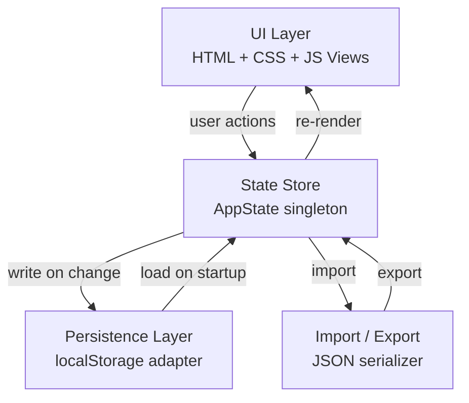

# Design Document: Daily Habit Portal

## Overview

The Daily Habit Portal is a single-page web application (SPA) built with vanilla HTML, CSS, and JavaScript. It replicates and extends a spreadsheet-based habit tracker, providing interactive grids, statistics, goal management, and full data portability via JSON import/export.

The app runs entirely in the browser with no backend. All state is persisted to `localStorage`. The UI is organized into navigable views: a Year Overview dashboard, per-month detail pages (daily grid, weekly summary, monthly habits, statistics), and a Goal Tracker.

Key design decisions:
- Vanilla JS (no framework) keeps the bundle zero-dependency and instantly runnable from a file system or static host.
- A single `AppState` object is the source of truth; all renders are driven from it.
- `localStorage` serialization uses a versioned JSON schema to support future migrations.

---

## Architecture



### Module Breakdown

| Module | Responsibility |
|---|---|
| `state.js` | AppState singleton, mutation methods, computed getters |
| `storage.js` | Read/write `localStorage`, schema versioning |
| `render.js` | Pure render functions — take state, return DOM mutations |
| `router.js` | Hash-based navigation between views |
| `export.js` | JSON serialization and file download |
| `import.js` | JSON validation and state replacement |
| `main.js` | Bootstrap: load state, bind events, initial render |

---

## Components and Interfaces

### Navigation

- Top nav bar with links: Year Overview | Month (Jan–Dec) | Goals
- Active month is highlighted; clicking a month sets `currentView = { type: 'month', month: N }`

### Year Overview

- 12 month cards in a grid, each showing month name and overall daily completion %
- Clicking a card navigates to that month's detail view
- Year-to-date average shown at the top

### Monthly Detail View

Tabs within the month view:
1. Daily Grid
2. Weekly Summary
3. Monthly Habits
4. Statistics

#### Daily Grid Tab

- Table: rows = habits, columns = days 1–31
- Cells for days beyond the month's actual length are visually disabled and non-interactive
- Each cell is a checkbox (or styled `<td>` acting as toggle)
- Footer row shows Daily_Progress % per column
- Header row shows day numbers

#### Weekly Summary Tab

- Weeks defined as: Week 1 = days 1–7, Week 2 = 8–14, Week 3 = 15–21, Week 4 = 22–28, Week 5 = 29–31 (or fewer), Others = any days not fitting neatly (edge case for months < 28 days handled by disabling)
- Per-week: total completions, total possible, completion %

#### Monthly Habits Tab

- List of monthly habits, each with a checkbox and a text input for notes
- Add / remove monthly habit controls
- Monthly notes textarea (free-text for the whole month)
- Monthly summary stats: total, completed, incomplete, %

#### Statistics Tab

- Per-habit row: habit name, days completed, completion %
- Consistency Rank: top 10 habits by completion count (ties broken alphabetically)

### Goal Tracker View

- Goals grouped by area of life (5 areas)
- Each goal card shows: description, reward, deadline, status badge, progress bar, steps list
- Add goal form: area, description, reward, deadline, steps (up to 8)
- Overdue + not-started goals visually flagged (e.g., red border)

### Habit Management

- Each month view has an "Edit Habits" mode
- In edit mode: add habit (text input + button), remove habit (× button per row)
- Changes immediately reflected in the grid

---

## Data Models

All data lives in a single `AppState` object that is serialized to/from `localStorage`.

### Schema (TypeScript-style for clarity)

```typescript
interface AppState {
  version: number;                        // schema version, currently 1
  months: MonthData[];                    // index 0 = January, index 11 = December
  goals: Goal[];
}

interface MonthData {
  monthIndex: number;                     // 0-based (0 = January)
  habits: string[];                       // ordered list of daily habit names
  entries: HabitEntries;                  // keyed by habitName -> day -> boolean
  weeklyHabits: WeeklyHabit[];            // habits tracked per week
  monthlyHabits: MonthlyHabit[];
  monthlyNotes: string;
}

// entries[habitName][dayNumber] = true | false | undefined (undefined = not set)
type HabitEntries = Record<string, Record<number, boolean>>;

interface WeeklyHabit {
  name: string;
  weeks: Record<string, boolean>;        // key: "week1" | "week2" | ... | "others"
}

interface MonthlyHabit {
  id: string;                            // uuid
  name: string;
  completed: boolean;
  notes: string;
}

interface Goal {
  id: string;                            // uuid
  area: LifeArea;
  description: string;
  reward: string;
  deadline: string;                      // ISO date string YYYY-MM-DD
  status: "Not Started" | "Achieved";
  steps: Step[];
}

interface Step {
  id: string;
  description: string;
  completed: boolean;
}

type LifeArea =
  | "Finances"
  | "Career"
  | "Personal Growth"
  | "Health & Wellness"
  | "Relationships";
```

### Computed Values (derived, never stored)

| Value | Formula |
|---|---|
| `dailyProgress(month, day)` | `completedHabits(day) / totalHabits * 100` rounded |
| `weeklyProgress(month, week)` | sum of completions in week / (habits × days in week) × 100 |
| `monthlyDailyAvg(month)` | mean of all `dailyProgress` values for days with at least one entry |
| `goalProgress(goal)` | `completedSteps / totalSteps * 100` rounded |
| `yearToDateAvg` | mean of `monthlyDailyAvg` across all months with data |
| `consistencyRank(month)` | habits sorted by total completions desc, then name asc |

### Days Per Month

```javascript
const DAYS_IN_MONTH = [31, 28, 31, 30, 31, 30, 31, 31, 30, 31, 30, 31];
// Feb is fixed at 28 (no leap year handling required per spec)
```

### Initial Seed Data

On first load (empty localStorage), the app seeds:
- January with 12 habits as specified
- February–December with 3 habits: "Wake up at 6:00 am", "Make the bed", "Move body for 30 minutes"
- Empty goals array

---

## Correctness Properties

*A property is a characteristic or behavior that should hold true across all valid executions of a system — essentially, a formal statement about what the system should do. Properties serve as the bridge between human-readable specifications and machine-verifiable correctness guarantees.*


### Property 1: Habit addition round-trip

*For any* month and any non-empty habit name, after adding that habit to the month, the month's habit list must contain that habit name.

**Validates: Requirements 1.2, 1.3**

---

### Property 2: Habit removal clears all entries

*For any* month and any habit that exists in that month, after removing the habit, neither the habit name nor any of its day entries should remain in that month's data.

**Validates: Requirements 1.4**

---

### Property 3: Month habit isolation

*For any* two distinct months A and B, modifying the habit list of month A must leave the habit list of month B unchanged.

**Validates: Requirements 1.5**

---

### Property 4: Daily progress formula

*For any* month, day, and set of habit completions, the computed `dailyProgress` must equal `Math.round(completedCount / totalHabits * 100)`, and must be 0 when no habits are completed (edge case: empty completions).

**Validates: Requirements 2.3, 2.4**

---

### Property 5: Grid column count bounded by month length

*For any* month, the number of active (non-disabled) day columns in the grid must equal the actual number of days in that month and never exceed 31.

**Validates: Requirements 1.1, 2.5**

---

### Property 6: Daily summary completeness and goal-met invariant

*For any* month and day, the `dailySummary` object must contain: `percentComplete`, `completedCount`, `incompleteCount`, and `goalMet`. The `goalMet` field must be `true` if and only if `percentComplete === 100`.

**Validates: Requirements 3.1, 3.2, 3.3**

---

### Property 7: Weekly partition covers all days

*For any* month, every day index (1 through days-in-month) must belong to exactly one week bucket (Week 1–5 or Others), and the union of all buckets must equal the full set of days.

**Validates: Requirements 4.1**

---

### Property 8: Weekly summary formula consistency

*For any* month and week bucket, the weekly completion percentage must equal `Math.round(totalCompletionsInWeek / (habitsCount * daysInWeek) * 100)`, and must always reflect the current state of `HabitEntries`.

**Validates: Requirements 4.2, 4.3**

---

### Property 9: Monthly summary formula consistency

*For any* month, the `monthlySummary` values (`total`, `completed`, `incomplete`, `percentage`) must be consistent with the underlying `monthlyHabits` array: `completed + incomplete === total` and `percentage === Math.round(completed / total * 100)`.

**Validates: Requirements 5.1, 5.2, 5.3**

---

### Property 10: Monthly notes round-trip

*For any* string saved as monthly notes for a month, reading the notes back must return the identical string.

**Validates: Requirements 5.4**

---

### Property 11: Per-habit statistics formula

*For any* month and habit, the displayed completion percentage must equal `Math.round(daysCompleted / daysInMonth * 100)`.

**Validates: Requirements 6.1**

---

### Property 12: Consistency rank ordering

*For any* month, the consistency rank list must be sorted by `daysCompleted` descending; when two habits have equal counts, they must be sorted alphabetically by name ascending (edge case: tie-breaking).

**Validates: Requirements 6.2, 6.3**

---

### Property 13: Goal validation rejects invalid inputs

*For any* goal creation attempt missing one or more required fields (area, description, reward, deadline, or at least one step), the system must reject the creation and leave the goals list unchanged.

**Validates: Requirements 7.2**

---

### Property 14: Goal step count bounded

*For any* goal, attempting to add a step when the goal already has 8 steps must be rejected, and the step count must remain 8.

**Validates: Requirements 7.3**

---

### Property 15: Goal status and progress invariants

*For any* goal, the `progress` field must equal `Math.round(completedSteps / totalSteps * 100)`. When all steps are marked complete, `status` must automatically be `"Achieved"`. The `status` field must only ever hold `"Not Started"` or `"Achieved"`.

**Validates: Requirements 7.4, 7.5, 7.6**

---

### Property 16: Overdue goal flag

*For any* goal whose `deadline` is before today's date and whose `status` is `"Not Started"`, the goal's view model must include an `isOverdue: true` flag.

**Validates: Requirements 7.7**

---

### Property 17: Year overview aggregation

*For any* app state, the year overview value for each month must equal the mean of all `dailyProgress` values for days that have at least one entry in that month. The year-to-date average must equal the mean of all such per-day values across all months with data.

**Validates: Requirements 8.1, 8.3**

---

### Property 18: State serialization round-trip

*For any* `AppState`, serializing it to JSON and deserializing it must produce a value that is deeply equal to the original state. This covers both the auto-save-on-toggle behavior and the full restore-on-reopen behavior.

**Validates: Requirements 9.1, 9.2, 9.3**

---

### Property 19: Export/import round-trip

*For any* `AppState`, exporting to JSON and then importing that JSON must produce a state deeply equal to the original, and the view must reflect the imported data.

**Validates: Requirements 10.1, 10.4**

---

### Property 20: Import validation rejects bad data

*For any* JSON string that does not conform to the expected schema, importing it must be rejected, an error message must be produced, and the existing state must remain unchanged.

**Validates: Requirements 10.2, 10.3**

---

## Error Handling

| Scenario | Behavior |
|---|---|
| `localStorage` unavailable or quota exceeded | Catch the write error, show a non-blocking toast: "Could not save data. Storage may be full." |
| Import file is not valid JSON | Show error: "Invalid file: not valid JSON." State unchanged. |
| Import JSON missing required top-level keys | Show error: "Invalid file: missing required fields (version, months, goals)." State unchanged. |
| Import JSON has wrong schema version | Show error: "Incompatible data version. Expected version 1." State unchanged. |
| Goal created with missing required fields | Inline form validation; submit button disabled until all required fields are filled. |
| Adding a 9th step to a goal | "Add step" button disabled when step count reaches 8. |
| Habit name is empty or whitespace-only | Reject with inline message: "Habit name cannot be empty." |
| Duplicate habit name within a month | Reject with inline message: "A habit with this name already exists for this month." |

---

## Testing Strategy

### Dual Testing Approach

Both unit tests and property-based tests are required. They are complementary:
- Unit tests cover specific examples, integration points, and edge cases.
- Property-based tests verify universal correctness across randomized inputs.

### Property-Based Testing

Library: **fast-check** (JavaScript/TypeScript PBT library).

Each correctness property from the design document maps to exactly one property-based test. Tests run a minimum of 100 iterations each.

Tag format in test files:
```
// Feature: daily-habit-portal, Property N: <property_text>
```

| Property | Test description |
|---|---|
| P1 | Habit addition round-trip |
| P2 | Habit removal clears all entries |
| P3 | Month habit isolation |
| P4 | Daily progress formula (including 0% edge case) |
| P5 | Grid column count bounded by month length |
| P6 | Daily summary completeness and goal-met invariant |
| P7 | Weekly partition covers all days |
| P8 | Weekly summary formula consistency |
| P9 | Monthly summary formula consistency |
| P10 | Monthly notes round-trip |
| P11 | Per-habit statistics formula |
| P12 | Consistency rank ordering (including tie-break edge case) |
| P13 | Goal validation rejects invalid inputs |
| P14 | Goal step count bounded at 8 |
| P15 | Goal status and progress invariants |
| P16 | Overdue goal flag |
| P17 | Year overview aggregation |
| P18 | State serialization round-trip |
| P19 | Export/import round-trip |
| P20 | Import validation rejects bad data |

### Unit Tests

Unit tests focus on:
- Specific examples: seeding January with 12 habits, February with 3
- Integration: toggling a cell updates daily progress, weekly summary, and localStorage in one action
- Edge cases: February with 28 days (no day 29–31 cells active), month with 0 habits defined
- Error conditions: all error handling scenarios from the table above

### Test File Structure

```
tests/
  unit/
    state.test.js       — AppState mutation methods
    storage.test.js     — localStorage adapter
    computed.test.js    — derived value calculations
    import.test.js      — import validation logic
  property/
    habits.property.js  — P1–P5
    daily.property.js   — P4, P6
    weekly.property.js  — P7, P8
    monthly.property.js — P9, P10
    stats.property.js   — P11, P12
    goals.property.js   — P13–P16
    overview.property.js — P17
    persistence.property.js — P18–P20
```
