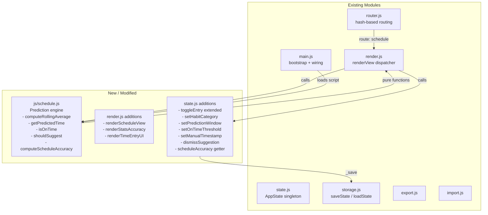

# Design Document — Smart Time Tracking

## Overview

Smart Time Tracking extends the Daily Habit Portal with completion-time recording, rolling-average schedule prediction, a new Schedule View, positive reinforcement toasts, manual time override, habit category metadata, optimization suggestions, and schedule accuracy statistics.

The implementation follows the existing conventions of the app: vanilla HTML/CSS/JS, no build step, all globals, `AppState` as the single source of truth, and Google Sheets as the persistence backend. One new module (`js/schedule.js`) is added for the prediction engine. All other changes are additive extensions to `state.js`, `render.js`, `router.js`, and `index.html`.

### Key Design Decisions

- **Timestamps stored inline with entries** — `entries[habitName][day]` is extended from a plain `boolean` to an object `{ done: boolean, ts?: string }`. This keeps the existing structure intact and is backward-compatible: the boolean fast-path is preserved by checking `entry.done ?? entry` (legacy boolean entries still work).
- **No new top-level state keys for per-habit metadata** — habit categories and dismissed suggestions are stored in new fields on `MonthData` (`habitCategories`, `dismissedSuggestions`) and on the root state (`predictionWindow`, `onTimeThreshold`, `positiveReinforcement`). This mirrors the existing pattern for `habitTags` and `habitFrequency`.
- **`js/schedule.js` is a pure computation module** — it contains no DOM code and no direct state mutations. All functions take data as arguments and return results, making them straightforward to test.
- **`#schedule` is a new top-level route** — it follows the same pattern as `#dashboard` and `#goals`.

---

## Architecture



### Module Load Order

`index.html` script tags (order matters):

```
auth.js → state.js → storage.js → router.js → schedule.js → render.js → export.js → import.js → main.js
```

`schedule.js` is inserted between `router.js` and `render.js` so that render functions can call schedule functions freely.

---

## Components and Interfaces

### 1. `js/schedule.js` — Prediction Engine

All functions are pure (no side effects, no DOM access).

```js
/**
 * Convert an HH:MM or HH:MM:SS string to minutes since midnight.
 * @param {string} timeStr
 * @returns {number}
 */
function timeToMinutes(timeStr) { ... }

/**
 * Convert minutes since midnight to "HH:MM" string.
 * @param {number} minutes
 * @returns {string}
 */
function minutesToTime(minutes) { ... }

/**
 * Extract the time portion (HH:MM:SS) from an ISO 8601 local datetime string.
 * @param {string} isoStr  e.g. "2025-07-14T06:03:00"
 * @returns {string}       e.g. "06:03:00"
 */
function extractTime(isoStr) { ... }

/**
 * Compute the rolling average predicted time for a habit.
 *
 * @param {string[]} timestamps  Array of ISO 8601 completion timestamps,
 *                               ordered oldest-first. Only the most recent
 *                               `window` entries are used.
 * @param {number}   window      Prediction window (3–5).
 * @returns {string|null}        "HH:MM" predicted time, or null if fewer
 *                               than 3 timestamps are provided.
 */
function computeRollingAverage(timestamps, window) { ... }

/**
 * Collect the N most recent completion timestamps for a habit across all
 * months in the given state, ordered oldest-first.
 *
 * @param {object} state       Full AppState
 * @param {string} habitName
 * @param {number} window      How many recent days to collect (3–5)
 * @returns {string[]}         Array of ISO 8601 timestamp strings
 */
function getRecentTimestamps(state, habitName, window) { ... }

/**
 * Return the predicted time for a habit, or null if insufficient data.
 *
 * @param {object} state
 * @param {string} habitName
 * @returns {string|null}  "HH:MM" or null
 */
function getPredictedTime(state, habitName) { ... }

/**
 * Determine whether a completion timestamp is within ±threshold minutes
 * of the predicted time.
 *
 * @param {string} completionTs   ISO 8601 timestamp
 * @param {string} predictedTime  "HH:MM"
 * @param {number} thresholdMins  Default 15
 * @returns {boolean}
 */
function isOnTime(completionTs, predictedTime, thresholdMins) { ... }

/**
 * Evaluate whether an optimization suggestion should be shown for a habit.
 *
 * Returns true when:
 *   - category is not "anytime"
 *   - at least 5 completion timestamps exist
 *   - 3 or more of the last 5 completed days fall outside the category window
 *
 * @param {string[]} timestamps   Recent completion timestamps (oldest-first)
 * @param {string}   category     Habit_Category value
 * @returns {boolean}
 */
function shouldSuggest(timestamps, category) { ... }

/**
 * Return the time window [startMin, endMin] for a given category.
 * @param {string} category
 * @returns {[number, number]}
 */
function categoryWindow(category) { ... }

/**
 * Compute per-habit schedule accuracy for a month.
 *
 * @param {object} monthData     MonthData object
 * @param {object} state         Full AppState (for cross-month predictions)
 * @param {number} thresholdMins On_Time_Threshold
 * @returns {Array<{ name: string, accuracy: number|null, onTime: number, total: number }>}
 */
function computeScheduleAccuracy(monthData, state, thresholdMins) { ... }

/**
 * Compute the overall (mean) schedule accuracy for a month.
 * Only habits with accuracy !== null are included.
 *
 * @param {Array<{ accuracy: number|null }>} perHabitAccuracy
 * @returns {number|null}
 */
function computeOverallAccuracy(perHabitAccuracy) { ... }
```

### 2. `state.js` Extensions

#### Extended `toggleEntry`

```js
/**
 * Toggle a habit entry. When marking complete, records a Completion_Timestamp.
 * When marking incomplete, removes the timestamp.
 *
 * Entry shape changes from:
 *   entries[habitName][day] = boolean
 * to:
 *   entries[habitName][day] = { done: boolean, ts?: string }
 *
 * Legacy boolean entries are read as { done: value, ts: undefined }.
 */
function toggleEntry(monthIndex, habitName, day) { ... }
```

#### New mutation methods

```js
/** Set a manual timestamp for a habit entry (also marks it complete). */
function setManualTimestamp(monthIndex, habitName, day, isoTimestamp) { ... }

/** Set the habit category for a habit in a month. */
function setHabitCategory(monthIndex, habitName, category) { ... }

/** Set the global prediction window (3–5). Returns { ok, error }. */
function setPredictionWindow(n) { ... }

/** Set the global on-time threshold in minutes. */
function setOnTimeThreshold(minutes) { ... }

/** Toggle positive reinforcement setting. */
function setPositiveReinforcement(enabled) { ... }

/** Dismiss an optimization suggestion for a habit. Records the rolling avg at dismissal time. */
function dismissSuggestion(monthIndex, habitName, rollingAvgMinutes) { ... }

/** Get the habit category for a habit (defaults to "anytime"). */
function getHabitCategory(monthIndex, habitName) { ... }
```

#### `setState` migration guard

`setState` is extended to migrate legacy entries:

```js
// In setState, for each month entry:
if (typeof entry === 'boolean') {
  month.entries[h][d] = { done: entry };
}
// New fields initialized if absent:
if (!m.habitCategories)      m.habitCategories      = {};
if (!m.dismissedSuggestions) m.dismissedSuggestions = {};
// Root-level:
if (!_state.predictionWindow)       _state.predictionWindow       = 5;
if (!_state.onTimeThreshold)        _state.onTimeThreshold        = 15;
if (_state.positiveReinforcement === undefined) _state.positiveReinforcement = true;
```

### 3. `render.js` Additions

#### `renderScheduleView(state)`

Renders the `#view-schedule` container. Sections:

1. **Header** — "Today's Schedule" + date
2. **Settings row** — prediction window selector (3/4/5), on-time threshold display, positive reinforcement toggle
3. **Habit list** — sorted by predicted time ascending, nulls last. Each row:
   - Habit name + category badge
   - Predicted time (or "No prediction yet")
   - Completion checkbox (wired to `toggleEntry`)
   - Clock icon → opens `renderTimeEntryUI`
4. **Suggestions section** — rendered only when suggestions exist

#### `renderTimeEntryUI(habitName, day, monthIndex, currentTs, onConfirm, onCancel)`

A modal overlay containing:

- **Scroll-wheel picker** — two `<select>` elements (hour 00–23, minute 00–59) styled as a drum-roll picker via CSS scroll-snap
- **Quick-select grid** — buttons for every 30 minutes from 05:00 to 23:00 (37 buttons). Clicking a quick-select button pre-fills the scroll-wheel and immediately confirms (1 interaction)
- **Confirm / Cancel** buttons

#### `renderStatsAccuracy(monthIndex, container)`

Appended to the existing Statistics tab panel. Renders:

- Section heading "⏱ Schedule Accuracy"
- Per-habit table: habit name | on-time days | total days | accuracy %
- Overall accuracy score row
- "Insufficient data" shown for habits with < 3 qualifying days

#### `renderScheduleView` — Suggestions sub-section

```
┌─ Suggestions ──────────────────────────────────────────────────────┐
│  ⚡ "Morning Run" — avg completion 13:45, recommended 05:00–11:59  │
│                                                    [Dismiss]        │
└────────────────────────────────────────────────────────────────────┘
```

### 4. `router.js` Extension

Add `'schedule'` to `_parseHash`:

```js
if (hash === 'schedule') return { type: 'schedule' };
```

`renderView` in `render.js` gains a `schedule` case:

```js
case 'schedule': renderScheduleView(state); break;
```

`_showView` gains `'view-schedule'` to its list.

### 5. `index.html` Changes

- Add `<div id="view-schedule" class="view hidden"></div>` inside `<main id="app">`.
- Add Schedule nav link in sidebar:
  ```html
  <a href="#schedule" class="nav-link" data-route="schedule">
    <span class="nav-icon">🕐</span>
    <span class="nav-text">Schedule</span>
  </a>
  ```
- Add `<script src="js/schedule.js"></script>` before `render.js`.

---

## Data Models

### Extended Entry Object

```
Before (legacy):
  entries[habitName][day] = true | false

After:
  entries[habitName][day] = {
    done: boolean,
    ts?:  string   // ISO 8601 local datetime "YYYY-MM-DDTHH:MM:SS"
  }
```

Backward compatibility: any code reading `entries[h][d]` must use the helper:

```js
function _entryDone(entry) {
  if (entry === null || entry === undefined) return false;
  if (typeof entry === 'boolean') return entry;   // legacy
  return entry.done === true;
}
```

### Extended `MonthData`

```
MonthData {
  // ... existing fields unchanged ...
  habitCategories:      { [habitName]: 'anytime'|'morning'|'afternoon'|'evening'|'peak-focus' }
  dismissedSuggestions: { [habitName]: { dismissedAt: string, avgAtDismissal: number } }
}
```

### Extended Root `AppState`

```
AppState {
  version: 1,
  year: number,
  months: MonthData[],
  goals: Goal[],
  templates: Template[],
  // NEW:
  predictionWindow:      3 | 4 | 5,          // default 5
  onTimeThreshold:       number,              // minutes, default 15
  positiveReinforcement: boolean              // default true
}
```

### Habit Category Constants

```js
const HABIT_CATEGORIES = ['anytime', 'morning', 'afternoon', 'evening', 'peak-focus'];

const CATEGORY_WINDOWS = {
  morning:      [5 * 60,  11 * 60 + 59],   // 05:00–11:59
  afternoon:    [12 * 60, 16 * 60 + 59],   // 12:00–16:59
  evening:      [17 * 60, 21 * 60 + 59],   // 17:00–21:59
  'peak-focus': [6 * 60,  10 * 60],        // 06:00–10:00
  anytime:      [0, 23 * 60 + 59]          // entire day
};
```

### Timestamp Format

All timestamps are stored as ISO 8601 local datetime strings without timezone offset:

```
YYYY-MM-DDTHH:MM:SS
e.g. "2025-07-14T06:03:00"
```

Validation regex: `/^\d{4}-\d{2}-\d{2}T\d{2}:\d{2}:\d{2}$/`

---

## Correctness Properties

*A property is a characteristic or behavior that should hold true across all valid executions of a system — essentially, a formal statement about what the system should do. Properties serve as the bridge between human-readable specifications and machine-verifiable correctness guarantees.*

### Property 1: Toggle-complete records a valid ISO 8601 timestamp

*For any* habit and day, when `toggleEntry` transitions the entry from incomplete to complete, the resulting entry object SHALL have a `ts` field that matches the pattern `YYYY-MM-DDTHH:MM:SS`.

**Validates: Requirements 1.1, 1.2**

---

### Property 2: Toggle-incomplete removes the timestamp

*For any* habit and day that has a `Completion_Timestamp`, when `toggleEntry` transitions the entry from complete to incomplete, the resulting entry object SHALL have `done === false` and no `ts` field (or `ts === undefined`).

**Validates: Requirements 1.3**

---

### Property 3: Rolling average formula correctness

*For any* array of 3–5 valid ISO 8601 timestamps, `computeRollingAverage` SHALL return the HH:MM string whose minutes-since-midnight value equals `Math.round(mean(timestamps.map(timeToMinutes)))`, where `timeToMinutes` extracts the time portion and converts to minutes.

**Validates: Requirements 2.1, 2.3**

---

### Property 4: Prediction window controls which timestamps are used

*For any* habit with more than 5 days of completion data and any window value W ∈ {3, 4, 5}, `getPredictedTime` SHALL produce a result equivalent to calling `computeRollingAverage` on exactly the W most recent completion timestamps, and SHALL return `null` when fewer than 3 timestamps exist.

**Validates: Requirements 2.1, 2.2, 2.6**

---

### Property 5: On-time detection is symmetric around the threshold

*For any* predicted time P and completion time C (both expressed as minutes since midnight), `isOnTime(C, P, threshold)` SHALL return `true` if and only if `|C - P| <= threshold`. This must hold for all valid times including midnight-crossing cases (e.g. predicted 00:05, completed 23:58).

**Validates: Requirements 4.1, 4.2, 4.4**

---

### Property 6: Schedule sort order — predicted times ascending, nulls last

*For any* array of habit objects with mixed predicted times (some `null`, some valid HH:MM strings), the sort function used by `renderScheduleView` SHALL produce an array where all non-null predicted times appear before null entries, and non-null entries are ordered ascending by their minutes-since-midnight value.

**Validates: Requirements 3.4**

---

### Property 7: Suggestion trigger logic

*For any* habit with category ≠ `"anytime"` and at least 5 completion timestamps, `shouldSuggest` SHALL return `true` if and only if 3 or more of the last 5 timestamps have a time-of-day that falls outside the category's defined window. For habits with category `"anytime"`, `shouldSuggest` SHALL always return `false` regardless of timestamps.

**Validates: Requirements 7.1, 7.2, 7.6**

---

### Property 8: Dismissal suppression until rolling average shifts

*For any* dismissed suggestion where the rolling average at dismissal was D minutes, `shouldSuggest` SHALL return `false` for that habit until the current rolling average differs from D by more than 30 minutes.

**Validates: Requirements 7.5**

---

### Property 9: Prediction window validation

*For any* integer N, `setPredictionWindow(N)` SHALL return `{ ok: true }` and update the setting if and only if N ∈ {3, 4, 5}. For all other values, it SHALL return `{ ok: false, error: string }` and leave the setting unchanged.

**Validates: Requirements 8.1, 8.5**

---

### Property 10: Backward compatibility — legacy boolean entries load without error

*For any* AppState object where some or all `entries[habitName][day]` values are plain booleans (legacy format), calling `AppState.setState` SHALL complete without throwing, and `_entryDone(entry)` SHALL return the correct boolean value for both legacy and new entry formats.

**Validates: Requirements 9.5**

---

### Property 11: Export/import round-trip preserves all time-tracking data

*For any* AppState containing `Completion_Timestamp` values, habit categories, prediction window, and dismissed suggestions, serializing to JSON (export) and then deserializing (import) SHALL produce a state object where every timestamp, category, window value, and dismissal record is identical to the original.

**Validates: Requirements 9.3, 9.2**

---

### Property 12: Schedule accuracy computation

*For any* set of completed habit days where K days are on-time and M days are off-time (K + M ≥ 3), `computeScheduleAccuracy` SHALL return `Math.round((K / (K + M)) * 100)` for that habit. When K + M < 3, it SHALL return `null`.

**Validates: Requirements 10.1, 10.2**

---

### Property 13: Habit category default

*For any* habit name that has no entry in `habitCategories`, `getHabitCategory` SHALL return `"anytime"`.

**Validates: Requirements 6.3**

---

### Property 14: Manual override stores the selected time and marks complete

*For any* habit (complete or incomplete) and any valid ISO 8601 timestamp T, calling `setManualTimestamp(monthIndex, habitName, day, T)` SHALL result in `entries[habitName][day].done === true` and `entries[habitName][day].ts === T`.

**Validates: Requirements 5.4, 5.5**

---

## Error Handling

| Scenario | Detection | Response |
|---|---|---|
| `toggleEntry` called on archived month | Check `month.archived` before mutation | No-op; optionally show toast "Month is archived" |
| `computeRollingAverage` receives < 3 timestamps | Length check at function entry | Return `null` |
| `setPredictionWindow` receives value outside {3,4,5} | Validate before mutation | Return `{ ok: false, error: 'Prediction window must be 3, 4, or 5 days.' }` |
| `setManualTimestamp` receives malformed ISO string | Regex test `/^\d{4}-\d{2}-\d{2}T\d{2}:\d{2}:\d{2}$/` | Return `{ ok: false, error: 'Invalid timestamp format.' }` |
| Import file contains malformed timestamps | Validate each entry during import in `import.js` | Skip the malformed entry; show toast listing skipped count |
| `timeToMinutes` receives malformed time string | Guard with regex; return `NaN` | Caller treats `NaN` as missing data; entry excluded from average |
| `getRecentTimestamps` finds no completed days | Returns empty array | `getPredictedTime` returns `null`; UI shows "No prediction yet" |
| `shouldSuggest` called with < 5 timestamps | Length check | Return `false` (no suggestion generated) |
| `computeScheduleAccuracy` called with no predictions | Filter for days with both ts and prediction | Returns `null` for that habit |
| Google Sheets save fails after timestamp write | Existing `saveState` error handler | Existing "Could not sync" toast; no data loss (state is in memory) |
| `setHabitCategory` receives invalid category string | Validate against `HABIT_CATEGORIES` array | Return `{ ok: false, error: 'Invalid category.' }` |

---

## Testing Strategy

### Overview

The testing approach uses two complementary layers:

- **Unit / property-based tests** — verify the pure functions in `schedule.js` and the new `state.js` mutations. These are fast, deterministic, and cover a wide input space.
- **Integration / example-based tests** — verify UI wiring, persistence round-trips, and cross-module interactions with representative examples.

### Property-Based Testing

The pure functions in `schedule.js` are ideal candidates for property-based testing. The recommended library is **[fast-check](https://github.com/dubzzz/fast-check)** (JavaScript), run via a simple Node.js test harness (no build step required — use `node --experimental-vm-modules` or a minimal test runner like `uvu`).

Each property test runs a minimum of **100 iterations**.

Tag format for each test: `// Feature: smart-time-tracking, Property N: <property_text>`

#### Property tests to implement

| Property | Function under test | Generator |
|---|---|---|
| P3: Rolling average formula | `computeRollingAverage` | `fc.array(fc.integer({min:0,max:1439}), {minLength:3,maxLength:5})` → convert to HH:MM strings |
| P4: Prediction window controls timestamps used | `getPredictedTime` | `fc.array(fc.record({done:fc.constant(true),ts:fc.string()}), ...)` |
| P5: On-time detection symmetric | `isOnTime` | `fc.integer({min:0,max:1439})` for predicted + offset within/outside threshold |
| P6: Sort order | sort comparator | `fc.array(fc.option(fc.string()))` of predicted times |
| P7: Suggestion trigger | `shouldSuggest` | `fc.array(fc.integer({min:0,max:1439}), {minLength:5,maxLength:20})` + category |
| P9: Window validation | `setPredictionWindow` | `fc.integer({min:-100,max:100})` |
| P10: Backward compat | `setState` + `_entryDone` | `fc.boolean()` for legacy entries |
| P11: Export/import round-trip | `exportData` + `importData` | `fc.record(...)` with timestamp arrays |
| P12: Accuracy computation | `computeScheduleAccuracy` | `fc.array(fc.record({onTime:fc.boolean()}), {minLength:0,maxLength:30})` |
| P13: Category default | `getHabitCategory` | `fc.string()` habit names not in categories map |
| P14: Manual override | `setManualTimestamp` | `fc.string()` matching ISO pattern |

### Unit / Example-Based Tests

- **Toggle records timestamp** — call `toggleEntry`, assert `entry.ts` matches ISO regex.
- **Toggle removes timestamp** — toggle on then off, assert `entry.ts` is absent.
- **Fewer than 3 timestamps → null prediction** — 0, 1, 2 timestamps each return `null`.
- **"No prediction yet" rendered** — render Schedule_View with a habit having 2 timestamps; assert text "No prediction yet" is present.
- **Positive reinforcement toast** — mock `showToast`; toggle a habit on-time; assert toast was called.
- **Positive reinforcement suppressed** — set `positiveReinforcement = false`; toggle on-time; assert toast not called.
- **Quick-select buttons** — render `renderTimeEntryUI`; assert 37 buttons exist (05:00–23:00 in 30-min steps).
- **Suggestion section absent when no suggestions** — render Schedule_View with all habits in "anytime" category; assert no suggestions section.
- **Overall accuracy is mean of per-habit values** — example with 3 habits at 80%, 60%, 100% → overall 80%.

### Integration Tests

- **Persistence round-trip** — call `toggleEntry`, serialize state, call `setState` with parsed JSON, assert timestamp is present.
- **Import rejects malformed timestamps** — import a JSON file with one valid and one invalid timestamp; assert only valid entry is imported.
- **Prediction window persisted** — set window to 3, serialize, reload, assert window is 3.
- **Schedule_View route** — navigate to `#schedule`; assert `view-schedule` is visible and `view-dashboard` is hidden.

### Accessibility

- All interactive elements in the Schedule_View and Time_Entry_UI have `aria-label` or visible labels.
- The time picker `<select>` elements have associated `<label>` elements.
- Toast notifications use `role="alert"` and `aria-live="polite"` (already present in the existing toast element).
- The suggestions section uses `role="region"` with `aria-label="Optimization Suggestions"`.
